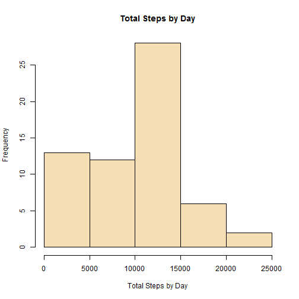
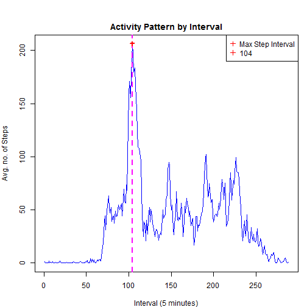
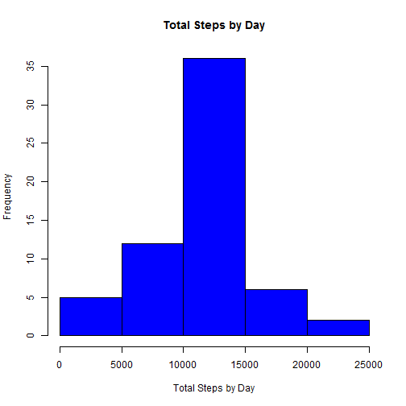
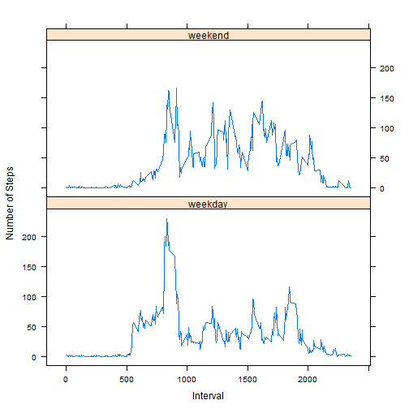

##Peer Assessment 1 for Reproducible Research
=============================================

Loading and preprocessing data

```r
library(dplyr)
library(ggplot2)
setwd("C:/Users/Jay/Documents/DataAnalysis/Data")
ActRawData <- read.csv(".\\activity.csv")
str(ActRawData)
```

```
## 'data.frame':	17568 obs. of  3 variables:
##  $ steps   : int  NA NA NA NA NA NA NA NA NA NA ...
##  $ date    : Factor w/ 61 levels "2012-10-01","2012-10-02",..: 1 1 1 1 1 1 1 1 1 1 ...
##  $ interval: int  0 5 10 15 20 25 30 35 40 45 ...
```

```r
#Converting the date column to date format
ActRawData$date <- as.Date(as.character(ActRawData$date))
#Copying the raw data into dataset for analysis
TidyActData <- ActRawData
str(TidyActData)
```

```
## 'data.frame':	17568 obs. of  3 variables:
##  $ steps   : int  NA NA NA NA NA NA NA NA NA NA ...
##  $ date    : Date, format: "2012-10-01" "2012-10-01" ...
##  $ interval: int  0 5 10 15 20 25 30 35 40 45 ...
```

Mean total number of steps taken per day

```r
TotStepsbyDay <- tapply(TidyActData$steps, TidyActData$date, sum, na.rm=T)
#Histogram for Total Steps by Day
hist(TotStepsbyDay, main="Total Steps by Day", col="wheat", xlab = "Total Steps by Day")
```

 

```r
# Bar plot - Total # of steps for each day
#barplot(TotStepsbyDay, col="wheat", xlab="Date", ylab="Total Steps", main="Total Steps #by Day")
# Calculate mean and median for each day
MeanStepsbyDay <- tapply(TidyActData$steps, TidyActData$date, mean,na.rm=T)
data.frame(MeanStepsbyDay)
```

```
##            MeanStepsbyDay
## 2012-10-01            NaN
## 2012-10-02      0.4375000
## 2012-10-03     39.4166667
## 2012-10-04     42.0694444
## 2012-10-05     46.1597222
## 2012-10-06     53.5416667
## 2012-10-07     38.2465278
## 2012-10-08            NaN
## 2012-10-09     44.4826389
## 2012-10-10     34.3750000
## 2012-10-11     35.7777778
## 2012-10-12     60.3541667
## 2012-10-13     43.1458333
## 2012-10-14     52.4236111
## 2012-10-15     35.2048611
## 2012-10-16     52.3750000
## 2012-10-17     46.7083333
## 2012-10-18     34.9166667
## 2012-10-19     41.0729167
## 2012-10-20     36.0937500
## 2012-10-21     30.6284722
## 2012-10-22     46.7361111
## 2012-10-23     30.9652778
## 2012-10-24     29.0104167
## 2012-10-25      8.6527778
## 2012-10-26     23.5347222
## 2012-10-27     35.1354167
## 2012-10-28     39.7847222
## 2012-10-29     17.4236111
## 2012-10-30     34.0937500
## 2012-10-31     53.5208333
## 2012-11-01            NaN
## 2012-11-02     36.8055556
## 2012-11-03     36.7048611
## 2012-11-04            NaN
## 2012-11-05     36.2465278
## 2012-11-06     28.9375000
## 2012-11-07     44.7326389
## 2012-11-08     11.1770833
## 2012-11-09            NaN
## 2012-11-10            NaN
## 2012-11-11     43.7777778
## 2012-11-12     37.3784722
## 2012-11-13     25.4722222
## 2012-11-14            NaN
## 2012-11-15      0.1423611
## 2012-11-16     18.8923611
## 2012-11-17     49.7881944
## 2012-11-18     52.4652778
## 2012-11-19     30.6979167
## 2012-11-20     15.5277778
## 2012-11-21     44.3993056
## 2012-11-22     70.9270833
## 2012-11-23     73.5902778
## 2012-11-24     50.2708333
## 2012-11-25     41.0902778
## 2012-11-26     38.7569444
## 2012-11-27     47.3819444
## 2012-11-28     35.3576389
## 2012-11-29     24.4687500
## 2012-11-30            NaN
```

```r
MedianStepsbyDay <- tapply(TidyActData$steps, TidyActData$date, median, na.rm=T)
data.frame(MedianStepsbyDay)
```

```
##            MedianStepsbyDay
## 2012-10-01               NA
## 2012-10-02                0
## 2012-10-03                0
## 2012-10-04                0
## 2012-10-05                0
## 2012-10-06                0
## 2012-10-07                0
## 2012-10-08               NA
## 2012-10-09                0
## 2012-10-10                0
## 2012-10-11                0
## 2012-10-12                0
## 2012-10-13                0
## 2012-10-14                0
## 2012-10-15                0
## 2012-10-16                0
## 2012-10-17                0
## 2012-10-18                0
## 2012-10-19                0
## 2012-10-20                0
## 2012-10-21                0
## 2012-10-22                0
## 2012-10-23                0
## 2012-10-24                0
## 2012-10-25                0
## 2012-10-26                0
## 2012-10-27                0
## 2012-10-28                0
## 2012-10-29                0
## 2012-10-30                0
## 2012-10-31                0
## 2012-11-01               NA
## 2012-11-02                0
## 2012-11-03                0
## 2012-11-04               NA
## 2012-11-05                0
## 2012-11-06                0
## 2012-11-07                0
## 2012-11-08                0
## 2012-11-09               NA
## 2012-11-10               NA
## 2012-11-11                0
## 2012-11-12                0
## 2012-11-13                0
## 2012-11-14               NA
## 2012-11-15                0
## 2012-11-16                0
## 2012-11-17                0
## 2012-11-18                0
## 2012-11-19                0
## 2012-11-20                0
## 2012-11-21                0
## 2012-11-22                0
## 2012-11-23                0
## 2012-11-24                0
## 2012-11-25                0
## 2012-11-26                0
## 2012-11-27                0
## 2012-11-28                0
## 2012-11-29                0
## 2012-11-30               NA
```

Average daily activity pattern

```r
#Calculate avg daily actvity by Intervals
aggIntdata <-aggregate(TidyActData, by=list(TidyActData$interval), FUN=mean, na.rm=TRUE)
#Plot average daily activity patterns
#Plot 1 - average daily activity patterns by interval
#Plot 2 - average daily activity patterns by abolute Time intervals
par(mfrow = c(1, 1), mar = c(4, 4, 2, 1), oma = c(0, 0, 2, 0))
with(aggIntdata, {
    plot(steps , type = "l", col="blue", main="Activity Pattern by Interval", xlab="Interval (5 minutes)", ylab = "Avg. no. of Steps")
	abline(v = which(steps==max(steps)), lty = 2, col = "magenta", lwd = 4)
	points(which(steps==max(steps)), max(steps),pch=3,cex=1,lwd=2,col="red")
	legend("topright", pch = 3, col = c("red"), legend = c("Max Step Interval" , which(steps==max(steps))))
	mtext("Average Daily Activity Pattern", outer = TRUE)}
)
```

 

```r
#Display Interval with maximum number of steps
paste(c("Interval with Max Steps: ") , which(aggIntdata$steps==max(aggIntdata$steps)))
```

```
## [1] "Interval with Max Steps:  104"
```

```r
paste(c("Time Interval with Max Steps: ") , aggIntdata$interval[which(aggIntdata$steps==max(aggIntdata$steps))])
```

```
## [1] "Time Interval with Max Steps:  835"
```

Imputing missing values

```r
#Calculate the total number of missing values in the dataset 
paste("Total number of missing values in the dataset: ", sum(is.na(TidyActData)))
```

```
## [1] "Total number of missing values in the dataset:  2304"
```

```r
# Split Data with NA and Non-NA records 
# Dataset with NA records
NAActData <- TidyActData[which(is.na(ActRawData$steps)),]
str(NAActData)
```

```
## 'data.frame':	2304 obs. of  3 variables:
##  $ steps   : int  NA NA NA NA NA NA NA NA NA NA ...
##  $ date    : Date, format: "2012-10-01" "2012-10-01" ...
##  $ interval: int  0 5 10 15 20 25 30 35 40 45 ...
```

```r
#Calculate avg daily actvity by Interval
aggIntdata <-aggregate(TidyActData, by=list(TidyActData$interval), FUN=mean, na.rm=TRUE)
# strategy for filling in all of the missing values in the dataset
# Use the average steps by interval data to update the steps with NA
mergedData <- merge(NAActData, aggIntdata, by = "interval")
NewNAActData <- select(mergedData, steps.y, date.x, interval)
colnames(NewNAActData) <- c("steps", "date", "interval")
str(NewNAActData)
```

```
## 'data.frame':	2304 obs. of  3 variables:
##  $ steps   : num  1.72 1.72 1.72 1.72 1.72 ...
##  $ date    : Date, format: "2012-10-01" "2012-11-30" ...
##  $ interval: int  0 0 0 0 0 0 0 0 5 5 ...
```

```r
# Dataet with no NA records
NonNAData <- TidyActData[which(!is.na(ActRawData$steps)),]
str(NonNAData)
```

```
## 'data.frame':	15264 obs. of  3 variables:
##  $ steps   : int  0 0 0 0 0 0 0 0 0 0 ...
##  $ date    : Date, format: "2012-10-02" "2012-10-02" ...
##  $ interval: int  0 5 10 15 20 25 30 35 40 45 ...
```

```r
# New dataset that is equal to the original dataset but with the missing data filled in
NewTidyData <- rbind(NonNAData, NewNAActData)
# Data ordered by date and interval
NewTidyData <- arrange(NewTidyData, date, interval)
str(NewTidyData)
```

```
## 'data.frame':	17568 obs. of  3 variables:
##  $ steps   : num  1.717 0.3396 0.1321 0.1509 0.0755 ...
##  $ date    : Date, format: "2012-10-01" "2012-10-01" ...
##  $ interval: int  0 5 10 15 20 25 30 35 40 45 ...
```

Mean total number of steps taken per day with imputed data

```r
par(mfrow = c(1, 1))
#Plotting total steps with new data
NewTotStepsbyDay <- tapply(NewTidyData$steps, NewTidyData$date, sum, na.rm=T)
#Histogram for Total Steps by Day
hist(NewTotStepsbyDay, main="Total Steps by Day", col="blue", xlab = "Total Steps by Day")
```

 

```r
NewMeanStepsbyDay <- tapply(NewTidyData$steps, NewTidyData$date, mean, na.rm=T)
# Compare Mean Steps by Day for original data and imputed data
data.frame(MeanStepsbyDay, NewMeanStepsbyDay)
```

```
##            MeanStepsbyDay NewMeanStepsbyDay
## 2012-10-01            NaN        37.3825996
## 2012-10-02      0.4375000         0.4375000
## 2012-10-03     39.4166667        39.4166667
## 2012-10-04     42.0694444        42.0694444
## 2012-10-05     46.1597222        46.1597222
## 2012-10-06     53.5416667        53.5416667
## 2012-10-07     38.2465278        38.2465278
## 2012-10-08            NaN        37.3825996
## 2012-10-09     44.4826389        44.4826389
## 2012-10-10     34.3750000        34.3750000
## 2012-10-11     35.7777778        35.7777778
## 2012-10-12     60.3541667        60.3541667
## 2012-10-13     43.1458333        43.1458333
## 2012-10-14     52.4236111        52.4236111
## 2012-10-15     35.2048611        35.2048611
## 2012-10-16     52.3750000        52.3750000
## 2012-10-17     46.7083333        46.7083333
## 2012-10-18     34.9166667        34.9166667
## 2012-10-19     41.0729167        41.0729167
## 2012-10-20     36.0937500        36.0937500
## 2012-10-21     30.6284722        30.6284722
## 2012-10-22     46.7361111        46.7361111
## 2012-10-23     30.9652778        30.9652778
## 2012-10-24     29.0104167        29.0104167
## 2012-10-25      8.6527778         8.6527778
## 2012-10-26     23.5347222        23.5347222
## 2012-10-27     35.1354167        35.1354167
## 2012-10-28     39.7847222        39.7847222
## 2012-10-29     17.4236111        17.4236111
## 2012-10-30     34.0937500        34.0937500
## 2012-10-31     53.5208333        53.5208333
## 2012-11-01            NaN        37.3825996
## 2012-11-02     36.8055556        36.8055556
## 2012-11-03     36.7048611        36.7048611
## 2012-11-04            NaN        37.3825996
## 2012-11-05     36.2465278        36.2465278
## 2012-11-06     28.9375000        28.9375000
## 2012-11-07     44.7326389        44.7326389
## 2012-11-08     11.1770833        11.1770833
## 2012-11-09            NaN        37.3825996
## 2012-11-10            NaN        37.3825996
## 2012-11-11     43.7777778        43.7777778
## 2012-11-12     37.3784722        37.3784722
## 2012-11-13     25.4722222        25.4722222
## 2012-11-14            NaN        37.3825996
## 2012-11-15      0.1423611         0.1423611
## 2012-11-16     18.8923611        18.8923611
## 2012-11-17     49.7881944        49.7881944
## 2012-11-18     52.4652778        52.4652778
## 2012-11-19     30.6979167        30.6979167
## 2012-11-20     15.5277778        15.5277778
## 2012-11-21     44.3993056        44.3993056
## 2012-11-22     70.9270833        70.9270833
## 2012-11-23     73.5902778        73.5902778
## 2012-11-24     50.2708333        50.2708333
## 2012-11-25     41.0902778        41.0902778
## 2012-11-26     38.7569444        38.7569444
## 2012-11-27     47.3819444        47.3819444
## 2012-11-28     35.3576389        35.3576389
## 2012-11-29     24.4687500        24.4687500
## 2012-11-30            NaN        37.3825996
```

```r
NewMedianStepsbyDay <- tapply(NewTidyData$steps, NewTidyData$date, median, na.rm=T)
# Compare Median Steps by Day for original data and imputed data
data.frame(MedianStepsbyDay, NewMedianStepsbyDay)
```

```
##            MedianStepsbyDay NewMedianStepsbyDay
## 2012-10-01               NA            34.11321
## 2012-10-02                0             0.00000
## 2012-10-03                0             0.00000
## 2012-10-04                0             0.00000
## 2012-10-05                0             0.00000
## 2012-10-06                0             0.00000
## 2012-10-07                0             0.00000
## 2012-10-08               NA            34.11321
## 2012-10-09                0             0.00000
## 2012-10-10                0             0.00000
## 2012-10-11                0             0.00000
## 2012-10-12                0             0.00000
## 2012-10-13                0             0.00000
## 2012-10-14                0             0.00000
## 2012-10-15                0             0.00000
## 2012-10-16                0             0.00000
## 2012-10-17                0             0.00000
## 2012-10-18                0             0.00000
## 2012-10-19                0             0.00000
## 2012-10-20                0             0.00000
## 2012-10-21                0             0.00000
## 2012-10-22                0             0.00000
## 2012-10-23                0             0.00000
## 2012-10-24                0             0.00000
## 2012-10-25                0             0.00000
## 2012-10-26                0             0.00000
## 2012-10-27                0             0.00000
## 2012-10-28                0             0.00000
## 2012-10-29                0             0.00000
## 2012-10-30                0             0.00000
## 2012-10-31                0             0.00000
## 2012-11-01               NA            34.11321
## 2012-11-02                0             0.00000
## 2012-11-03                0             0.00000
## 2012-11-04               NA            34.11321
## 2012-11-05                0             0.00000
## 2012-11-06                0             0.00000
## 2012-11-07                0             0.00000
## 2012-11-08                0             0.00000
## 2012-11-09               NA            34.11321
## 2012-11-10               NA            34.11321
## 2012-11-11                0             0.00000
## 2012-11-12                0             0.00000
## 2012-11-13                0             0.00000
## 2012-11-14               NA            34.11321
## 2012-11-15                0             0.00000
## 2012-11-16                0             0.00000
## 2012-11-17                0             0.00000
## 2012-11-18                0             0.00000
## 2012-11-19                0             0.00000
## 2012-11-20                0             0.00000
## 2012-11-21                0             0.00000
## 2012-11-22                0             0.00000
## 2012-11-23                0             0.00000
## 2012-11-24                0             0.00000
## 2012-11-25                0             0.00000
## 2012-11-26                0             0.00000
## 2012-11-27                0             0.00000
## 2012-11-28                0             0.00000
## 2012-11-29                0             0.00000
## 2012-11-30               NA            34.11321
```

Activity Patterns between weekdays and weekends

```r
#Add new column Day
NewTidyData$Day <- weekdays(NewTidyData$date)
#Changing the Day column "weekend" if it Saturday or Sunday and "weekday" otherwise
NewTidyData$Day[!(NewTidyData$Day %in% c('Saturday','Sunday'))] = "weekday"
NewTidyData$Day[NewTidyData$Day %in% c('Saturday','Sunday')] = "weekend"
#Calculate 
WdWeData <- aggregate(steps ~ interval + Day, data = NewTidyData, mean)
#plot containing a time series plot (i.e. type = "l") of the 5-minute interval (x-axis) #and the average number of steps taken
library(lattice)
xyplot(steps ~ interval | Day , data = WdWeData, type = "l", layout = c(1, 2), ylab = "Number of Steps", xlab="Interval")
```

 

```r
#qplot(interval, steps, data=WdWeData, geom=c("line"), facets = Day~.)
```

